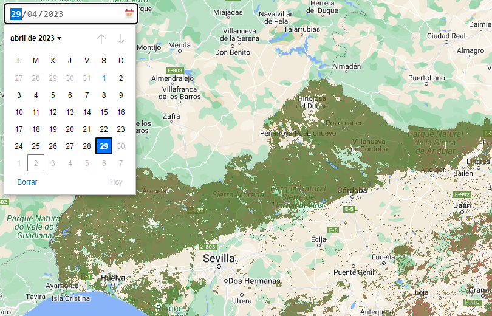

# leaflet-calendar

[](https://www.npmjs.com/package/leaflet-calendar)


A calendar date picker for Leaflet.

See the [demo](http://antoniovlx.github.io/leaflet-calendar/examples/index.html).



## Usage

````javascript
 L.control.calendar({
      id: 1,
      minDate: "2023-04-01",
      maxDate: "2023-04-29",
      onSelectDate: (value: string) => this.onSelectDate(value),
      position: "topleft",
    }).addTo(this.map);
  }

  onSelectDate(value: string): void {
    alert("Date: " + value)
  }
````

## License
This software is released under the [MIT licence](http://www.opensource.org/licenses/mit-license.php). Icon used in the example are from [https://www.flaticon.com](https://www.flaticon.com).
