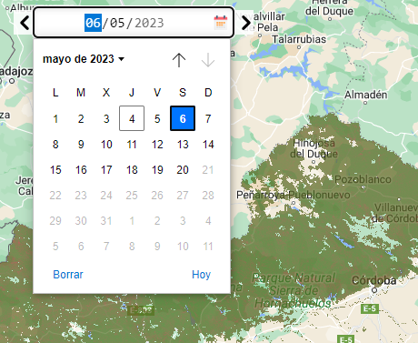

# leaflet-calendar

[](https://www.npmjs.com/package/leaflet-calendar)


A calendar date picker for Leaflet.

See the [demo](http://antoniovlx.github.io/leaflet-calendar/examples/index.html).



## Usage

````javascript
 L.control.calendar({
      id: 1,
      minDate: "2023-04-01",
      maxDate: "2023-04-29",
      onSelectDate: (value) => this.onSelectDate(value),
      position: "topleft",
    }).addTo(this.map);
  }

  onSelectDate(value): void {
    alert("Date: " + value)
  }
````

The `onSelectDate` function is your custom function which is triggered everytime the date is changed.

### Options

See table below for full description of customizable options for your calendar picker.

| Option | Description      | Default             |
| ----- | ----------- | ----------- |
| position      | Position of calendar picker ('topleft','topright','bottomleft','bottomright') | "bottomright" |
| minDate   | Minimum selectable date value in the calendar | '' |
| maxDate | Maximun selectable date value in the calendar. | '' |
| value | Initial date selected (YYYY-MM-DD). | Current date |
| onSelectDate   | Function that will execute when a date is selected.  | `function(value) { console.log("The function is mandatory"); }` |
| triggerFunctionOnLoad | Trigger `onSelectDate` function on first load | false |
| nextButton | Add a next button | true |
| backButton | Add a back button | true |
| marginLeft   | Left margin in pixels of the container | "10px" |
| marginRight   | Right margin in pixels of the container | "10px" |
| marginTop | Top margin in pixels of the container | "10px" |
| marginBottom | Bottom margin in pixels of the container | "10px" |

## License
This software is released under the [MIT licence](http://www.opensource.org/licenses/mit-license.php). Icon used in the example are from [https://www.flaticon.com](https://www.flaticon.com).
